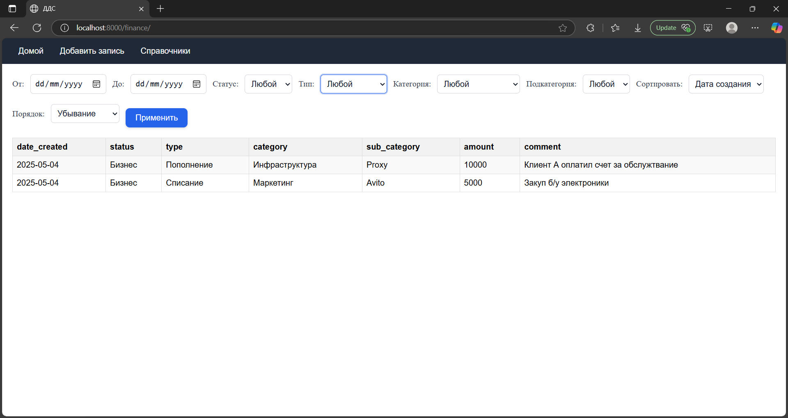
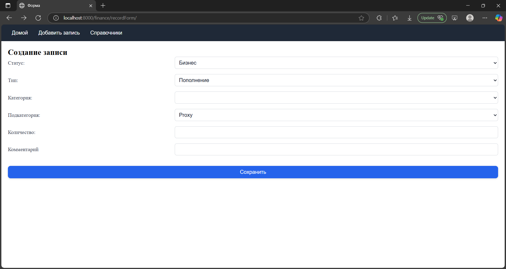
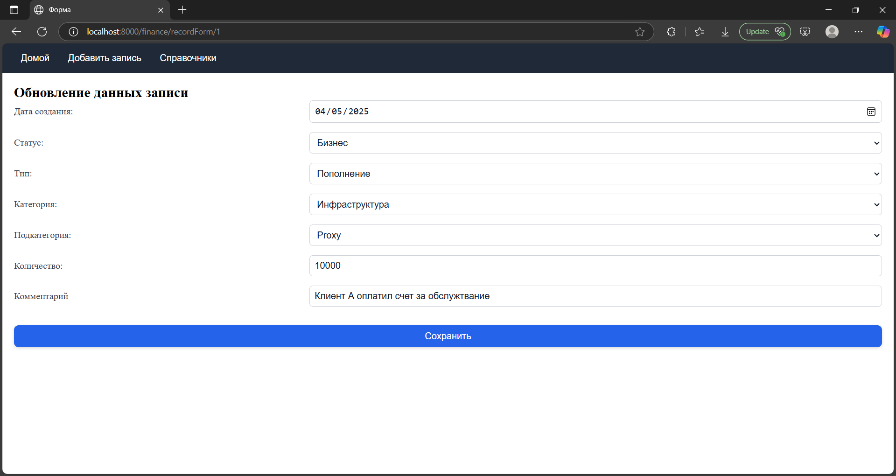
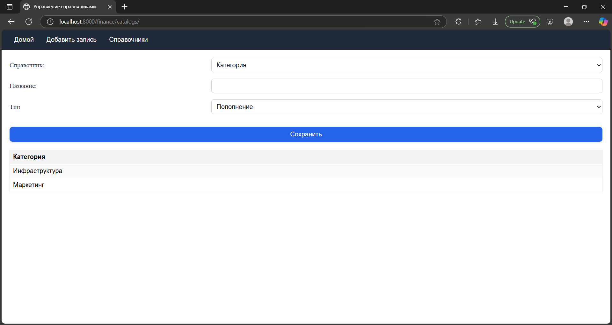

# Веб-сервис для управления движением денежных средств (ДДС)

## Функционал
- Создание записей о расходах и прибыли (ДДС)
- Управление категориями, подкатегориями, типами, статусами записей
- Просмотр информации о движении денежных средств (ДДС)

## Системные требования
- Python 3.1+
- Django

## Установка

Клонируйте гитхаб репозиторий на свое устройство
```
git clone github.com/strashacc/moneyService
```

Перейдите в папку с исходным кодом
```
cd moneyService
```

Далее установите требуемые модули для запуска программы
```
python -m venv venv
source venv/bin/activate
```

```
pip install django
```

Примените миграции базы данных
```
python manage.py migrate
```

Загрузите начальные данные (необязательно)
```
python manage.py loaddata data.json
```

Запустите веб-сервис
```
python manage.py runserver
```

## Использование

Сервис запускается на *<адрес сервера>:8000/finance*

### Главная страница


### Страница создания/изменения записи



### Страница управления справочниками
